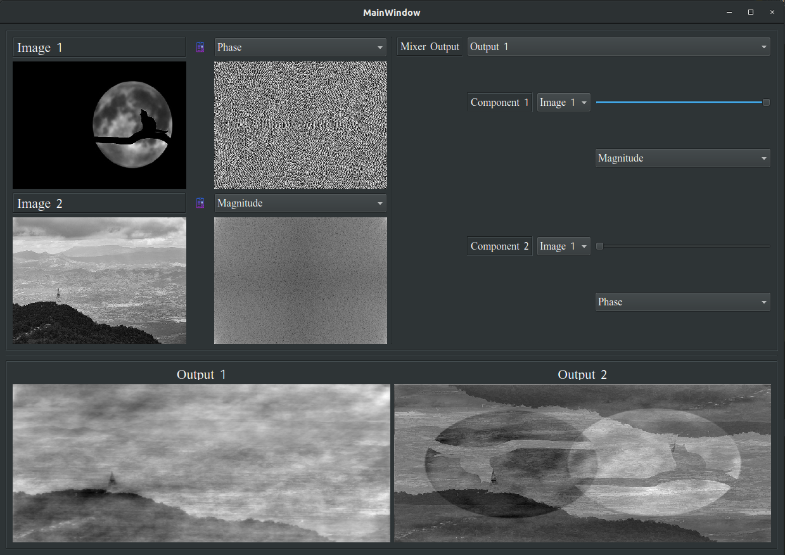
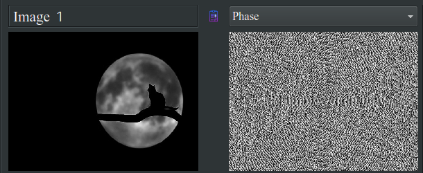
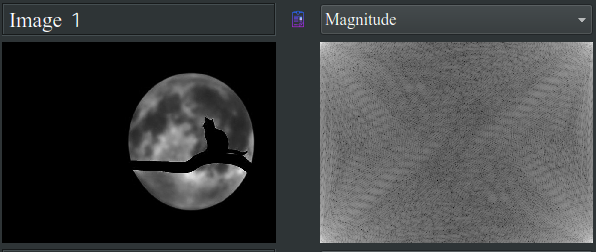
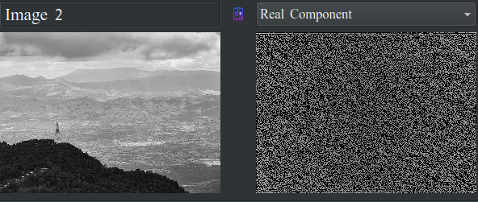
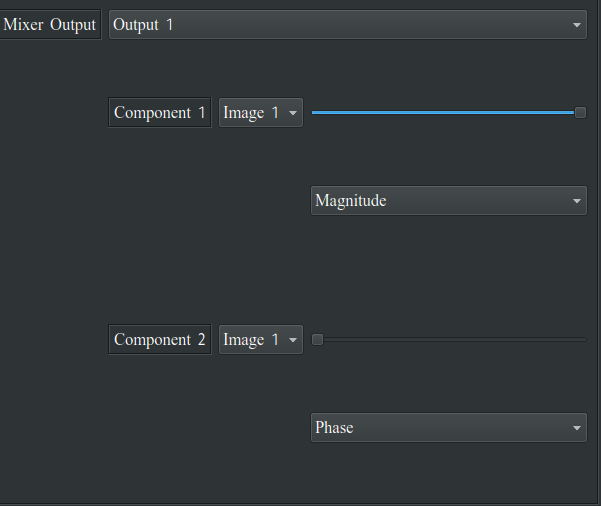
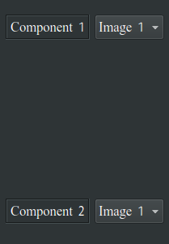
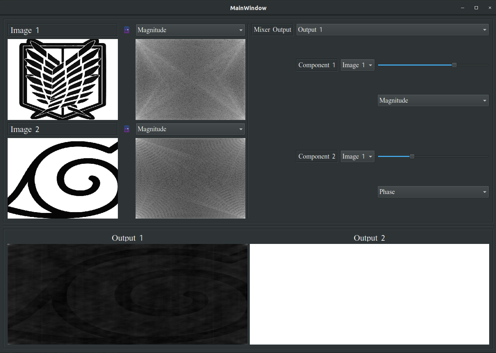
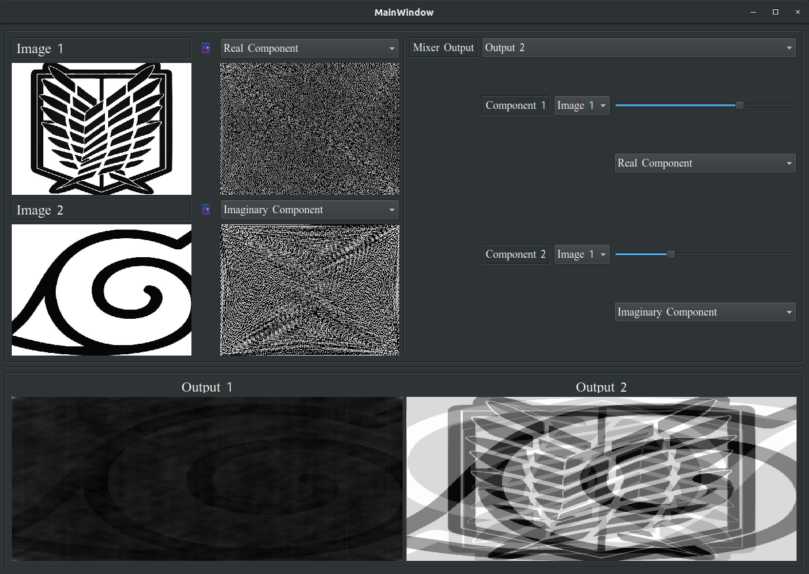

## Name: Ahmad Abdelmageed Ahmad

## ID: 8 Sec: 1

# PhaseMonster

An elegant program for mixing images, includes many features and modes . 

## Usage

You can jump around and explore but the basic usage is as follows: 

* Load the image in the slot you want from the loading button next to each slot 

* you can choose from the components in combo box which component to show 

* output one is aleeady default you can choose a different one like two any time 

* from the mixer panel choose the mode you desire, Real/Imaginary or Phase/Magnitude

* if you want different setting for components you can choose which component is which image from the combo boxes 

  below

   

  and bam you got yourself your first mix with PhaseMagniutde monster !!! 

## Some Results 

Here are some results from the mixer.

* 70% Magnitude and 30% Phase from image 1 in output 1

* 70% Real and 30% Imaginary from image one in output two

